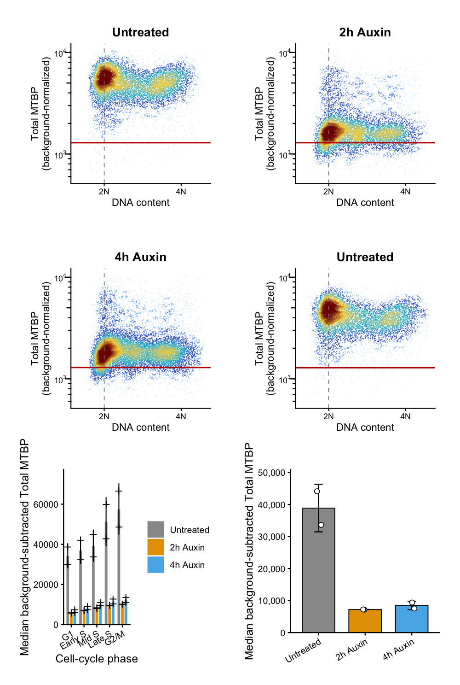
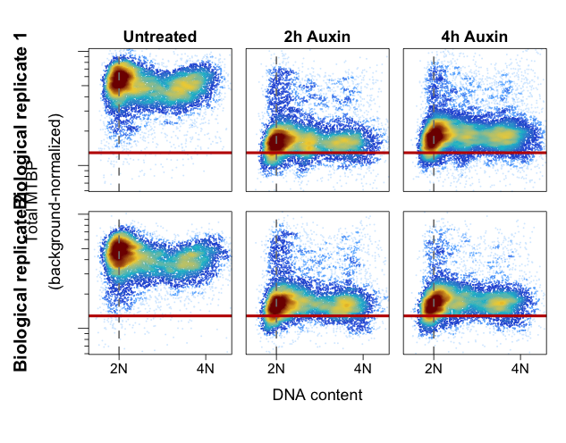
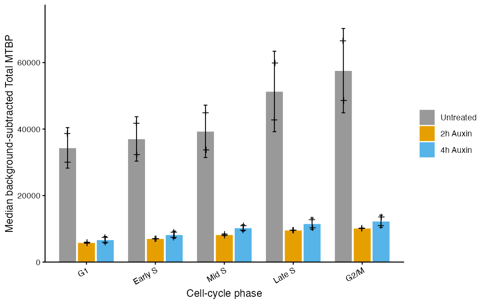
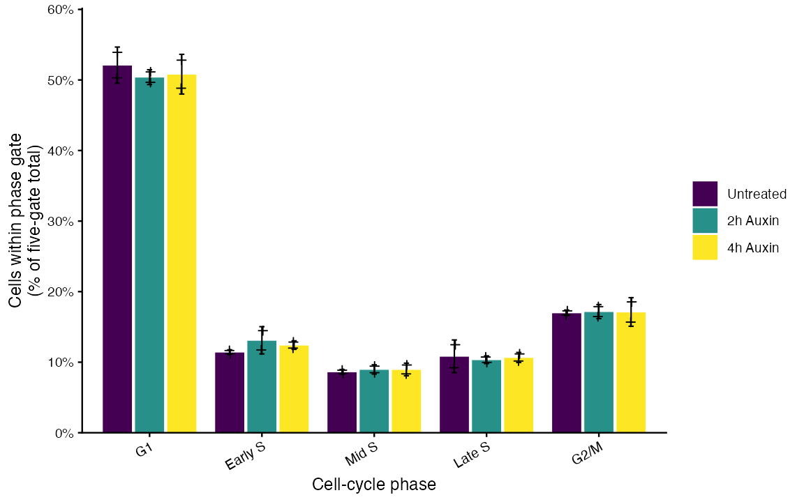
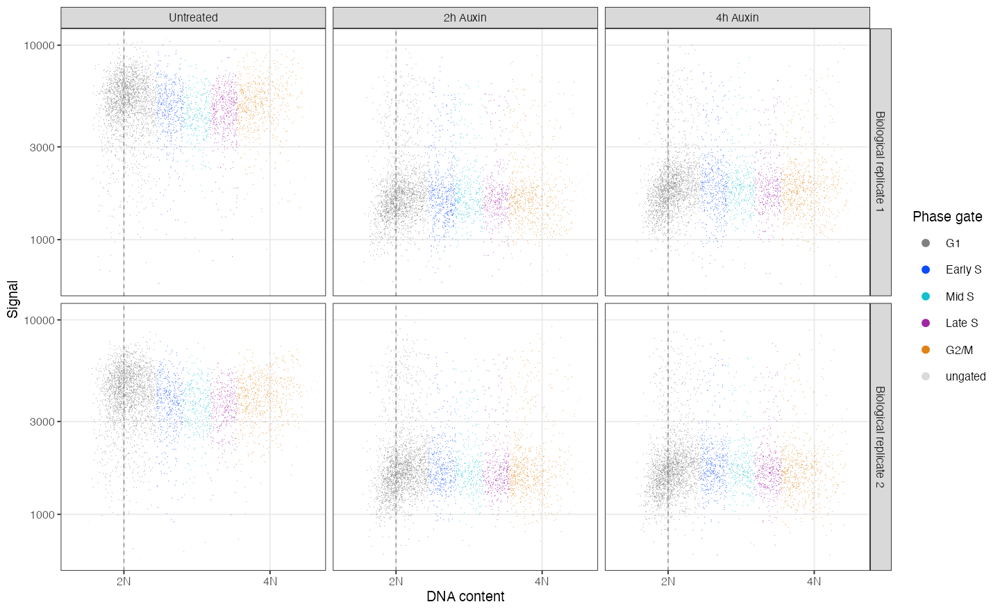

# Reusable reports and RDS artifacts

Every analysis calculates all supported quantitation for both the
background-subtracted and background-normalized signals. Reports select which
results to display; they do not change scientific calculations.

For pH3 analyses, the reports instead display all supported pH3 quantities:
overall pH3-positive percentage, percentages of all Single Cell events that are
pH3-positive in each DNA phase, unassigned pH3-positive events, the FlowJo gate
diagnostic, and G2/M boundary sensitivity.

## Choose one input

Every report requires exactly one of:

- `config`: validate CSVs and perform the analysis; or
- `analysis_rds`: reuse a previously completed analysis.

Supplying both or neither is an error.

## Templates

| Template | Purpose |
|---|---|
| `facs_complete.qmd` | Pseudocolor, quantitation, tables, and provenance. |
| `facs_pseudocolor.qmd` | Editable signal-versus-DNA panels. |
| `facs_quantitation.qmd` | Phase and whole-population signal summaries. |
| `facs_cell_cycle.qmd` | Cell-cycle phase percentages and gates. |
| `facs_diagnostics.qmd` | Gate assignments, fits, input checks, and warnings. |
| `facs_ph3_4n.qmd` | Exact FlowJo pH3 gate, pseudocolor, and gate percentage. |

## Example gallery

All previews below are generated from the public POI example data by
`tools/build-report-gallery.R`.

| Template | Preview |
|---|---|
| Complete |  |
| Pseudocolor |  |
| Quantitation |  |
| Cell cycle |  |
| Diagnostics |  |

Installed templates are available through:

```r
system.file("quarto", "facs_complete.qmd", package = "facspseudocolor")
```

## Appearance options

Template appearance parameters default to `null`. Null values are ignored, so
package defaults remain authoritative. An optional appearance YAML can provide
report-specific overrides without changing the analysis RDS.

Condition colors use a dynamically sized viridis palette by default. The
package determines the number and ordering of conditions from the analysis;
templates never hard-code sample labels.

```yaml
condition_palette: "colorblind"
y_limits: [600, 30000]
condition_colors:
  "Untreated": "#808080"
```

The package discovers condition labels and panel counts from the analysis.
Named condition colors may be partial; unmatched conditions receive stable
automatic colors. Unknown labels are rejected.

## Durable artifacts

`save_facs_analysis()` writes the scientific source of truth, including event
data, fits, all quantitation, configuration, warnings, and provenance.

`save_facs_figure_bundle()` writes editable individual ggplots, summarized
plot-ready tables, resolved appearance, and Plotgardener layout metadata. It
does not duplicate event-level data.

```r
analysis <- read_facs_analysis("results/analysis.rds")
bundle <- build_facs_figure_bundle(analysis)
save_facs_figure_bundle(bundle, "results/figures.rds")

panel <- get_facs_panel(bundle, "rep1_NT")
panel + ggplot2::theme_classic(base_size = 8)
```

Multipanel bundles are assembled with Plotgardener. Individual components stay
as editable ggplot objects for later publication layouts.

The gallery currently uses the public POI example. A pH3 gallery example will
require a suitably licensed real pH3 dataset; production examples are not
silently generated or simulated.

The focused pH3 report additionally requires exactly one
`gate_geometry_csv`, created separately from the FlowJo workspace. Its optional
gate fill, opacity, label color, label size, and label precision parameters
default to `null`, preserving package presentation defaults until overridden.
